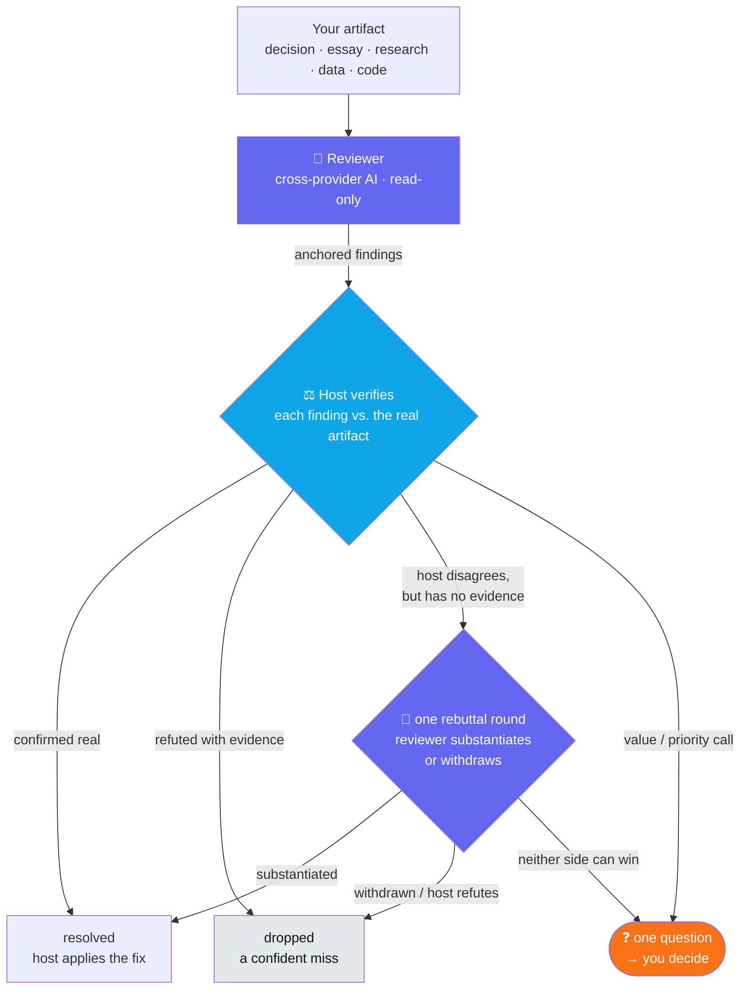
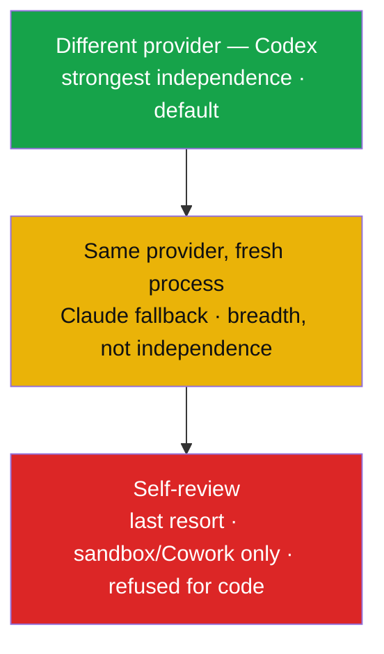

# Impasse

> **An independent second opinion for any high-stakes call — a decision, an essay, a research
> claim, a dataset, or code — from a cross-provider AI whose blind spots are *less likely to match* your own.**

*Impasse is the reference implementation of **Cross-Lab Adversarial Review (CLAR)** — defined
below, and written up in [the CLAR essay](https://www.movingavg.com/essays/cross-lab-adversarial-review.html).*

The independent **reviewer never edits your work** — it argues, with evidence. Keeping the critic
away from the pen is the point: fixes get applied by the host — the AI agent you're already working in (Claude Code or Codex), which
drives Impasse — or by you, never by the model that's supposed to be checking you. And unlike a plain code reviewer, it doesn't hand you
a raw list to triage — it **verifies each finding, reconciles the two models, and escalates only
the genuine disagreement.** You get the verified problems, plus the call(s) that are actually yours.



The reviewer (indigo) proposes; the host (blue) verifies and applies the fixes they agree on; the
judgment calls come to you. The independent reviewer never edits — the critic and the editor stay
separate. A refutation only *drops* a finding when the host has contradicting evidence — a host
disagreement with no evidence isn't a refutation, so it goes back to the reviewer for one round,
then to you if neither side can win.

**Status: pre-release.** The open implementation of the pattern — named in
[the CLAR essay](https://www.movingavg.com/essays/cross-lab-adversarial-review.html) and told as a
field story in [*AI's Second Opinion: When Rival Models Disagree*](https://www.movingavg.com/essays/ai-second-opinion-rival-model.html).
The Codex path, consent gate, and schemas are implemented and tested; verify → reconcile →
escalate is **directed by the host skill, not enforced in code** — a review is only as good as the
host's adherence to the protocol (see [How it works](#how-it-works)). Dogfooding it on its own source caught a real
shipping bug before release. It drives the Codex CLI it finds on your machine (see Install for how it's located). That CLI is a
fast-moving alpha, so behavior is best-effort and version-sensitive — the `docs/backends/codex.md`
observations may go stale. Expect rough edges.

## Example

Ask Claude Code in plain English:

> Use Impasse to get a second opinion on this market-entry memo before I commit.

It runs a cross-provider reviewer, verifies each finding against your artifact, and hands back a
report — the problems worth acting on, the ones the host threw out, and the calls that are yours:

```text
📊 Findings: 4 raised → 🤝 2 resolved · ❌ 1 refuted · ⚖️ 1 escalated to you
──────────────────────────────────────────────────────────────
F001, F003  🟢       🤝 resolved — host confirmed and fixed both (details elided)
F002  🟠 high  ❌ refuted
  🔎 Reviewer: the go-to-market is undifferentiated.
  ◀ Host:     the memo already concedes the product itself is a commodity and stakes its case on
              distribution — a rediscovered premise, not a gap. Refuted, with the quote.
F004  🟠 high  ⚖️ ESCALATED — needs your decision
  ❓ Enter Europe to diversify beyond a single market, or protect the nine-month runway?
──────────────────────────────────────────────────────────────
📈 Your Impasse record — 9 reviews reconciled
   31 findings reviewed · 22 resolved · 4 accepted · 3 refuted with evidence · 2 escalated to you
```

*Example output. The reviewer never edits your work; the host applies the fixes it verifies, and
only the genuine disagreement reaches you. Your record is local to your machine and grows as you use it.*

## Why — Cross-Lab Adversarial Review (CLAR)

> **Cross-Lab Adversarial Review (CLAR)** is the practice of putting a model from a *different
> lab* against the work — an AI's, or a person's — as an adversarial reviewer. The rival needn't
> be smarter; it's differently trained, so its blind spots are less likely to match. That is the
> value — decorrelation beats intelligence: their agreement carries real information, and the
> disagreement they can't resolve marks the call that still needs a human.

The premise — that shared blind spots are the risk, and that crossing labs *reduces* them — is
grounded in two findings. *Great Models Think Alike and this Undermines AI
Oversight* ([arXiv:2502.04313](https://arxiv.org/abs/2502.04313)) finds model errors are
substantially shared, and more so among more-capable models — the reason self- and same-model
review is a weaker control than it looks. *Correlated Errors in Large Language Models* (Kim et
al., [arXiv:2506.07962](https://arxiv.org/abs/2506.07962)) measures the overlap directly: models
agree on the same wrong answers well above chance, with the correlation lower — but far from zero
— across labs. **Neither paper tests an adversarial-review protocol; they establish the problem
CLAR responds to, not its effectiveness.** Cross-lab review buys a discount on shared blind
spots, not an exemption — which is why agreement stays evidence, not proof.

**Cross-lab vs cross-provider.** "Cross-lab" names the intent — a reviewer trained by a
*different lab*, which is where the decorrelation comes from. A tool has to select by API
provider, the practical proxy for lab; the two usually coincide but not always (Azure serves
OpenAI's models), so Impasse's cross-*provider* backend is the means and the different lab is the
point.

Impasse runs that cross-provider review, **verifies each finding**, reconciles the two models,
and reports the verified problems plus the disagreements that need your judgment — not a raw
list to triage.

It is **domain-general** — the same protocol reviews:

- a **decision / strategy** memo (hidden assumptions, unpriced tradeoffs),
- a **document / essay** (unsupported claims, weak or self-contradicting arguments),
- **research** (a citation that doesn't support its claim, overgeneralization),
- **code** (correctness, security, missing error handling),
- a **dataset** or other artifact.

## How it works

1. **Review** — an independent reviewer returns structured findings, each with *anchored
   evidence* (a location in the artifact **plus** an observation — a bare location isn't
   evidence).
2. **Verify** — the host checks each finding against the actual artifact before trusting it.
3. **Reconcile** — resolve, accept, or refute (with evidence) each finding; one rebuttal round.
4. **Report + escalate** — you get the verified findings to act on, and *only* the deadlock —
   an evidence conflict, a value/priority judgment that's yours to make, or a host objection it
   couldn't back with evidence — comes to you as a crisp question:

   > **Question for you:** For a company earning almost all its revenue in one market, the
   > reviewer argues that entering Europe reduces concentration risk; the memo argues it delays
   > break-even by nine months. Which matters more here — runway, or geographic diversification?

**See a second decision reviewed end to end** — a *different* memo (build-vs-buy on payments infrastructure), not code — from rival finding
to the call that needs a human: [`docs/walkthrough-decision.md`](docs/walkthrough-decision.md).

Full protocol: [`docs/protocol.md`](docs/protocol.md).

## What the reviewer checks for

The reviewer **observes and argues — it never edits your artifact; the critic never holds the
pen.** Every finding must carry *anchored evidence*: a specific location **and** an observation of
what's wrong there — never a bare "line 40 looks off." What it looks for adapts to the artifact:

- **Decision / strategy** — hidden assumptions, unpriced tradeoffs, and each *materially-affected
  stakeholder's* view (who executes it, who bears the downside, the customer, the regulator).
- **Document / essay** — unsupported claims, weak or self-contradicting arguments, structure.
- **Research** — a citation that doesn't support its claim, overgeneralization, missing counter-evidence.
- **Code** — correctness, security, edge cases, missing error handling.
- **Data / other** — whatever the artifact's own structure makes checkable.

Then the host does the part the reviewer can't be trusted with: **verify** each finding
against the real artifact, **refute** the confident misses with evidence, and **escalate** only the
judgment call. The reviewer proposes, the host verifies and fixes, and you decide the rest.

## What a run surfaces

The output is what *survived* scrutiny — the reviewer's findings, with a disposition on each. On
a decision artifact (a market-entry memo, not code), a run can produce several dispositions; here are the three most common:

- **Resolved** — the reviewer flags that the revenue model leans on a churn rate cited nowhere
  in the memo. The host checks, confirms the number is unsupported, and fixes it. → a real
  gap, closed. (Had the host agreed but only *noted* it for later, the disposition would be **accepted**.)
- **Refuted with evidence** — the reviewer calls the go-to-market "undifferentiated." The host
  points to the paragraph where the memo already concedes the product is a commodity and stakes
  its case on distribution — the reviewer rediscovered a stated premise, not a hole. Refuted,
  with the quote. → the verify step catching a confident miss, so it never reaches you.
- **Escalated** — for a company concentrated in one market, the reviewer wants to enter Europe to
  diversify; the memo wants to protect a nine-month cash runway rather than spend it on a launch.
  Neither is a fact — it's a risk-vs-survival call. It comes to you as one question. → routed,
  not decided.

That mix — most findings resolved, some refuted on evidence, a few escalated — is what a run is
for: an independent model checks the work, the host filters its misses where it can, and the
genuine judgment calls come to you. Each report (`impasse_report.py show`) closes with a running tally across your reviews.

## Dogfooding — the maintainer's ledger

The maintainer's practice is to put substantial changes through Impasse before shipping them.
Below is what that practice has produced so far — **a snapshot of every reconciled review record
on the maintainer's machine, all artifact kinds** (as of 2026-07-18). It is a count of what the
saved records contain — not an audit proving every change was reviewed, and not a complete count
of every event in every conversation:

| Metric | Count |
|---|---|
| Reviews reconciled | 65 |
| Findings raised by the reviewer | 391 |
| … resolved (host addressed the finding) | 345 |
| … accepted (host agreed; noted or deferred) | 36 |
| … refuted — each with contradicting evidence, as the schema requires of a saved refutation | 10 |
| … withdrawn | 0 |

**Escalation counts are deliberately not reported yet.** An important operational metric is how
often findings need a human ruling — no reliable historical rate exists. The counting rule only
recently became channel-independent (an operator ruling that decides a disposition now counts as
an escalation whether it arrived through a formal deadlock or through conversation), and the
operator attests that more judgment calls reached him than the pre-rule records captured.
Historical events whose exact wording is no longer recoverable can't be amended in (the rule
requires the question as actually posed), so rather than publish a number known to undercount,
**the ledger will report the escalation rate — escalated findings ÷ all reconciled findings — after the next 50 reconciled
reviews under the corrected rule** (counting from 2026-07-18; the maintainer applies the rule).
The same capture caveat bounds the whole table: these are counts of what the saved
reconciliations contain — unrecorded raw-mode runs (which skip reconciliation, see Fast checks), failed runs, and anything never reconciled are outside
them by construction. Review runs that fail outright produce no reconciliation and are not in
the 65. At least one run did fail outright — see below.

Four of these reviews covered **this codebase's own release cycle** (23 findings). Three times
the cross-provider reviewer **overturned a design decision** the author then conceded — a fail-open host-identity fallback that overstated independence in exactly
the case it existed to prevent; a retryability spec the operator himself had written, which mislabeled a permanent failure as worth retrying; and a
byte-vs-character bound that could let a silently truncated reviewer message pass as a complete
review. One review run also **failed outright** on malformed reviewer JSON — that failure became
[issue #1](https://github.com/windaddict/impasse/issues/1) and the retry logic that fixed it.
The [CHANGELOG](CHANGELOG.md) summarizes each episode; the resulting code and tests are in this
repository. The raw run records stay local **by design** — they can contain reviewed artifact
content (see the data-boundary section) — so what's public is the maintainer's summaries and the
diffs, not the reviewer transcripts. **With one deliberate exception:** for the fail-open case,
the full reviewer response and reconciliation are published verbatim in
[`docs/evidence/host-independence-review/`](docs/evidence/host-independence-review/) (the
reviewed artifact was this repo's own public code, so nothing sensitive rode along), with the
case narrated for non-developers in
[`docs/case-study-host-independence.md`](docs/case-study-host-independence.md).

**Weigh this for what it is:** author-run dogfooding on the author's own artifacts, reported by
the author. It's offered as a process record, not proof — and it says nothing yet about how
Impasse performs on *your* work.

## Requirements

- A **host**: [Claude Code](https://claude.com/claude-code) or the [OpenAI Codex CLI](https://github.com/openai/codex)
  — both implement the open [Agent Skills standard](https://agentskills.io). Independence is computed
  *relative to your host*, so which of the two tools counts as the cross-provider **backend** below inverts accordingly.
- At least one **reviewer backend** installed and logged in, ideally the one that *differs* from your
  host (the cross-provider rung): the **Codex CLI** for a Claude host
  ([`docs/backends/codex.md`](docs/backends/codex.md)), or the **Claude CLI** for a Codex host
  ([`docs/backends/claude.md`](docs/backends/claude.md)). `--backend auto` (the default) picks the most
  independent one available; the same-provider backend still runs as a weaker fallback (breadth, not
  independence).
- Python 3 (standard library only — the shipped helpers have no pip dependencies).
- macOS or Linux. Windows via WSL; native Windows is on the [roadmap](docs/windows.md).

### How independent is it?

Independence is a ladder, not a switch — and Impasse always tells you which rung you're on. A
different provider is the point; the fallbacks trade independence for reach.



For the usual Claude host, genuine independence needs a Codex login; the weaker rungs run on
Claude alone. The rungs are labeled **relative to the host** driving the protocol (the diagram
shows the Claude-host case): to a Codex host, the Claude backend is the different-provider rung.
The runner **auto-detects** which agent it runs under — Claude and Codex (the supported hosts), and also
Gemini and Cursor, so a non-supported host is never misread as a supported one — from their env markers — best-effort for Codex, which ships no branded flag — and `IMPASSE_HOST` stays
authoritative (validated and conflict-checked). Detection is fail-safe: ambiguity or a
marker/override conflict yields `undetermined`, never an overstated cross-provider claim, and
because detection reads environment variables, its confidence is only as good as the environment's integrity. Detail:
[`docs/environments.md`](docs/environments.md), [`docs/host-detection.md`](docs/host-detection.md).

## Install

Impasse is an Agent Skill — the repository *is* the skill directory. Install it where your host looks
for skills:

**Claude Code** — clone into the skills dir:

```bash
git clone https://github.com/windaddict/impasse ~/.claude/skills/impasse
```

**OpenAI Codex** — clone anywhere, then run the installer (a safe, symlink-only install that detects
the Codex skills root), and restart Codex:

```bash
git clone https://github.com/windaddict/impasse ~/src/impasse
bash ~/src/impasse/scripts/install-codex.sh   # symlinks into ~/.codex/skills/impasse
```

**Invoke it through your host** — there is no separate `impasse` binary; it runs inside the agent:

- **Claude Code** — the `/impasse` slash command, or just ask ("Use Impasse to review this decision memo").
- **OpenAI Codex** — `$impasse`, or ask by description.

(Power users can call the helpers directly: `python3 <skill-dir>/scripts/impasse_run.py review …` — see
[`SKILL.md`](SKILL.md). That's what the host runs under the hood.)

One clone can serve **both** hosts at once — symlink it into each skills dir (`~/.claude/skills/impasse`
and `~/.codex/skills/impasse`); they share one host-agnostic config dir — `~/Library/Application Support/impasse` on macOS, `~/.config/impasse` on Linux (consent, records, settings).

**Both hosts installed? For a standard install there's usually nothing to configure — Impasse finds
the backends itself.** Each backend is resolved in this order: an explicit override
(`IMPASSE_CODEX_BIN` / `CODEX_BIN`, `IMPASSE_CLAUDE_BIN` / `CLAUDE_BIN`) → `PATH` → backend-specific
known locations (Homebrew, `/usr/local/bin`, `~/.local/bin`, npm-global for both — plus the
`ChatGPT.app` / `Codex.app` bundle for Codex). So on a Claude host it finds Codex (the cross-provider
default) and on a Codex host it finds Claude, without you pointing at anything. You only need to set
an override if a binary lives somewhere nonstandard or your `PATH` is stripped (e.g. an nvm/fnm-managed
`codex`). Host identity is auto-detected too (`IMPASSE_HOST` overrides).

**Choosing the reviewer model:** by default the backend's own default is used. Ask Claude Code to
pick one and it presents the options (Codex can't enumerate models, so it's a curated list plus a
free-text "other" — availability depends on your account). Or set it directly: `--model <name>` per
run, `scripts/impasse_run.py set-model --backend codex <name>` to persist, or the
`IMPASSE_CODEX_MODEL` / `IMPASSE_CLAUDE_MODEL` env var. Precedence: flag > env > persisted > default.
Pinning a model *different* from the host's buys a little extra independence *within* a rung (a different model, same provider).

**Fast checks (`--raw`):** for a quick, low-stakes look at your own work, `review --raw` returns the
reviewer's findings and skips the verify → reconcile → escalate protocol (and doesn't record). The
findings are **unverified** — the host hasn't checked them — so use the full protocol when it matters.

## Data boundary & consent

Reviewing an artifact sends its content to a third-party provider. Impasse **blocks by
default** until you approve the destination, and shows a payload manifest so you approve *what*
is sent, not just *where*. **Grant the endpoint your host's cross-provider backend actually uses** —
the blocked run's manifest names it:

```bash
# Claude host (cross-provider reviewer = codex):
python3 scripts/impasse_consent.py grant https://api.openai.com  --backend-type codex-cli
# Codex host (cross-provider reviewer = claude):
python3 scripts/impasse_consent.py grant https://api.anthropic.com --backend-type claude-cli
```

Consent is keyed to the normalized endpoint (a custom `OPENAI_BASE_URL` / `ANTHROPIC_BASE_URL` needs
its own grant), stored `0600` in your platform config dir. **Don't send secrets or regulated data without
authorization.** See [`docs/security-model.md`](docs/security-model.md).

## Structured output

Reviews and reconciliations are JSON, shaped by
[`schemas/reviewer-response.v1.json`](schemas/reviewer-response.v1.json) and
[`schemas/reconciliation-result.v1.json`](schemas/reconciliation-result.v1.json). At runtime the
runner parses the JSON and checks the required top-level fields; **full JSON-Schema validation runs in
CI (`tests/validate_schemas.py`) or is the host's job**, not the hot path. Domain
generality comes from an evidence *anchor* union (`file_range | text_quote | section |
structured_path | generic`) plus an optional external-source citation — see the worked
[`schemas/examples/`](schemas/examples/).

## Disclaimer

Impasse is provided under the MIT License, **"AS IS", without warranty of any kind** — including no
warranty of merchantability, fitness for a particular purpose, or non-infringement. Its outputs
(and the reviewer's) may be wrong and are **not legal, financial, medical, tax, or other
professional advice**, nor a substitute for professional or human judgment. Verify important
conclusions; **you remain responsible for every decision and every change you make.** A second
model is not an independent source of truth — see the independence caveat in the security model.

To the maximum extent permitted by law, the authors are not liable for any damages arising from use
of the software, and are **not responsible for the third-party AI providers** (OpenAI, Anthropic) —
their availability, output, pricing, or handling of the data you choose to send them. Impasse is
**pre-release**: interfaces, storage formats, and behavior may change without notice.

## Acceptable use

These are reminders of your responsibilities under the law and the providers' terms — not
additional conditions Impasse places on the MIT license:

- **Don't send** secrets, credentials, personal or regulated data, or anyone else's confidential
  information without authorization — the tool doesn't scan for them, and a send leaves your machine
  for a third-party provider.
- **Comply with the backends' own terms** — the [OpenAI Usage Policies](https://openai.com/policies/usage-policies/)
  and the [Anthropic Usage Policy](https://www.anthropic.com/policies/usage-policy), and each
  provider's privacy and data-handling terms, govern what you send; you are responsible for your API
  keys, provider accounts, and any usage costs.
- **Don't rely on it for unlawful, harmful, or high-stakes automated decisions** without human
  review. Impasse routes the judgment calls to a human by design — keep it that way.
- **Export/sanctions:** you are responsible for complying with applicable export-control and
  sanctions laws, and with your providers' geographic restrictions.

Impasse stores **run records locally** (the config dir's `runs/`) — they hold whatever you sent, so
treat the local store as sensitive. Impasse itself sends your artifact only to the provider you
invoke. Delete Impasse's local records with `impasse_report.py forget <id>` or `prune` — this
removes only Impasse's local copies, not anything already sent to a provider.

## Related work

OpenAI ships an official [Codex plugin for Claude Code](https://github.com/openai/codex-plugin-cc)
with read-only and adversarial **code** review, an optional review gate, and delegated Codex
tasks. Impasse is a different layer: a **domain-general** review-and-reconciliation protocol
(decisions, documents, research, data, and code) that verifies each finding and reconciles the
two models, escalating only what they can't settle rather than returning the review to triage.
Its cross-provider reviewer is whichever backend differs from your host — Codex for a Claude host,
Claude for a Codex host — chosen by `--backend auto`; the same-provider backend is a weaker fallback
(breadth, not independence). The protocol is backend- and host-neutral.

**Lineage of the term.** CLAR names a practice with real antecedents. Its human ancestor is
*adversarial collaboration* — opponents designing a fair test together, with an arbiter — as
practiced by Mellers, Hertwig, and Kahneman ([2001](https://doi.org/10.1111/1467-9280.00350)).
The AI lineage runs through AI safety via debate (Irving et al., [2018](https://arxiv.org/abs/1805.00899)),
multiagent debate (Du et al., [2023](https://arxiv.org/abs/2305.14325)), LLM-as-a-judge (Zheng et al.,
[2023](https://arxiv.org/abs/2306.05685)), and PoLL (Verga et al., [2024](https://arxiv.org/abs/2404.18796)),
which already juries across providers. Practitioners have described the same cross-lab practice
under longer names. CLAR is a short label and a discipline for a practice that was already
emerging; the term was introduced here, July 2026. Full write-up:
[the CLAR essay](https://www.movingavg.com/essays/cross-lab-adversarial-review.html).

## Repository layout

```
SKILL.md              the skill (how the host drives Impasse)
schemas/              reviewer-response + reconciliation-result + examples
scripts/              stdlib-Python helpers (consent, supervised runner, lib)
docs/                 protocol, security model, backend, delegate mode (experimental, opt-in: lets the reviewer edit — off by default), platform support
tests/                schema validation + helper tests (CI)
```

## Audit trail & reports

Non-raw reviews are recorded by default — the reviewer's findings, and (once you save it) the
reconciliation — under your config dir (skipped by `--raw` and `--no-record`; a recording failure is
surfaced, never silent). `scripts/impasse_report.py show <review_id>` renders a recorded run: the
**reviewer↔host back-and-forth** on each finding, the **decision** made, a **tally** (raised /
resolved / accepted / refuted / escalated), and the questions escalated to you. `list` shows
past runs (flagging which still have open escalations); `forget` deletes one. `open` surfaces
runs with decisions you haven't answered yet; `prune --older-than N` cleans up old records
(keeping any with open escalations unless `--include-open`). Records contain artifact content —
they're kept `0600` and never committed.

Every `show` closes with a **running recap across your reconciled runs** — findings reviewed,
resolved, accepted, refuted with evidence, and escalated to you — a plain reminder of what independent
review has surfaced. Deeper longitudinal reporting (trends over time, per-artifact history) is
still roadmap; each run is fully inspectable on its own.

## Who builds this

Impasse is a working artifact from [Moving Average](https://www.movingavg.com/), an AI advisory
practice for CEOs and founders. The pattern behind it — running a rival model as an independent
reviewer and routing only the real disagreements to a human — is written up in the essay
[*AI's Second Opinion*](https://www.movingavg.com/essays/ai-second-opinion-rival-model.html).
Wiring model-to-model governance into how a team actually decides is the kind of thing the
[AI Workshop for CEOs](https://www.movingavg.com/ai-workshop-for-ceos.html) works through with a
group of executives. If that's the problem you're facing, start there.

## License & trademarks

MIT — see [`LICENSE`](LICENSE). Claude, Claude Code, Codex, OpenAI, and Anthropic are trademarks of
their respective owners, used here only for identification and comparison (nominative fair use).
Impasse is independent and is **not affiliated with, sponsored by, or endorsed by** them. See
[`NOTICE`](NOTICE).
